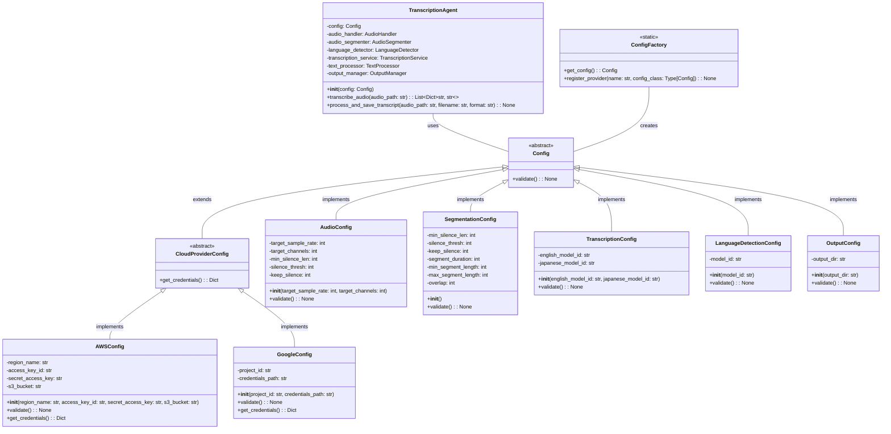
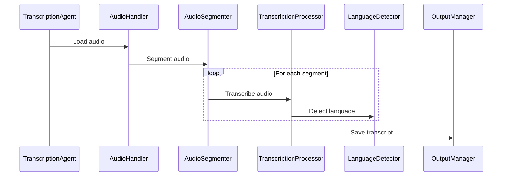

# Architecture

The project follows a modular architecture with comprehensive audio processing, language detection, transcription, and output management capabilities. The system is designed to be extensible, supporting multiple cloud providers and configuration options.

## Class Diagram

## Core Components

### Audio Processing
- **AudioHandler**: Handles audio file loading, format conversion, and preprocessing
  - Supports multiple audio formats
  - Normalizes audio levels
  - Configurable sample rate and channels
  - Error handling for corrupted files

- **AudioSegmenter**: Implements multiple segmentation strategies
  - Silence-based segmentation
  - Fixed-length segmentation with overlap
  - Energy-based segmentation using RMS values
  - Configurable parameters via SegmentationConfig

### Language Services
- **LanguageDetector**: Intelligent language detection
  - Supports English and Japanese
  - Uses AWS Comprehend
  - Configurable confidence thresholds

- **TextProcessor**: Language-specific text processing
  - English text normalization
  - Japanese text formatting
  - Number and unit handling
  - Contraction expansion
  - Punctuation normalization

### Transcription
- **TranscriptionService**: Cloud service integration
  - AWS Bedrock support
  - Google Cloud support (prepared)
  - Error handling and retries
  - Configurable models per language

- **BedrockClient**: AWS Bedrock integration
  - Claude 3 model support
  - Optimized prompts per language
  - Efficient API usage

### Output Management
- **OutputManager**: Multiple format support
  - Plain text (TXT)
  - Structured JSON
  - Subtitles (SRT)
  - Custom format extensibility

### Configuration
- **ConfigFactory**: Dynamic configuration management
  - Environment-based configuration
  - Multiple provider support
  - Validation and error checking
  - Easy extensibility

## Data Flow

1. **Input Processing**:
   - Audio file is loaded by AudioHandler
   - Audio is normalized and converted to standard format
   - Segmentation is performed based on configured strategy

2. **Language Processing**:
   - Each segment is analyzed for language
   - Language-specific models are selected
   - Text processing is applied based on detected language

3. **Transcription**:
   - Segments are transcribed using appropriate model
   - Results are post-processed
   - Text is normalized and formatted

4. **Output Generation**:
   - Results are collected and organized
   - Formatting is applied based on output type
   - Files are saved to configured location

## Error Handling

The system implements comprehensive error handling:
- Audio file validation and format checking
- Network error recovery and retries
- Invalid configuration detection
- Resource cleanup
- Detailed error logging

## Testing

The project includes extensive testing:
- Unit tests for all components
- Integration tests for the complete pipeline
- Configuration validation tests
- Error handling tests
- Format conversion tests

## Performance Considerations

- Efficient audio segmentation
- Optimized API calls
- Memory management for large files
- Configurable processing parameters
- Resource cleanup

## Modules

- **`src/agent.py`**: Contains the `TranscriptionAgent` class, which is the main entry point for the project. It orchestrates the transcription process by using the other modules.
- **`src/config.py`**: Contains the configuration classes that store the project's settings.
- **`src/audio/`**: Contains the audio handling modules.
    - **`src/audio/handler.py`**: Handles audio loading and processing.
    - **`src/audio/segmenter.py`**: Handles audio segmentation.
- **`src/language/`**: Contains the language detection modules.
    - **`src/language/detector.py`**: Detects the language of the transcribed text.
- **`src/transcription/`**: Contains the transcription modules.
    - **`src/transcription/processor.py`**: Processes the audio and performs the transcription using AWS Bedrock.
    - **`src/transcription/service.py`**: Provides the transcription service.
- **`src/output/`**: Contains the output management modules.
    - **`src/output/manager.py`**: Manages the output of the transcripts.
- **`src/aws/`**: Contains the AWS Bedrock client.
    - **`src/aws/bedrock_client.py`**: Initializes and configures the AWS Bedrock client.

## Sequence Diagram

## Configuration

The project uses configuration classes to store settings. These classes are defined in the `src/config.py` file. The configuration classes are:

- `AWSConfig`: Stores AWS settings.
- `AudioConfig`: Stores audio settings.
- `TranscriptionConfig`: Stores transcription settings.
- `LanguageDetectionConfig`: Stores language detection settings.
- `OutputConfig`: Stores output settings.

