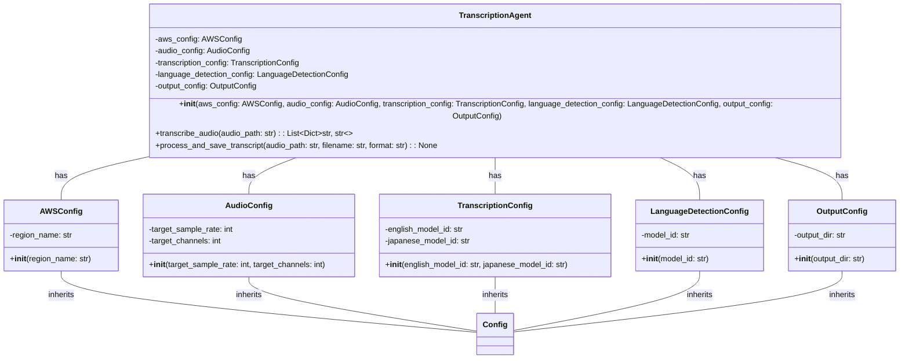
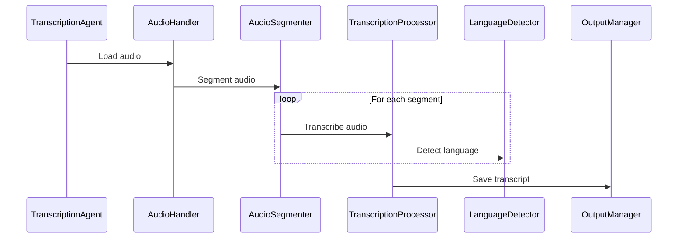

# Architecture

The project follows a modular architecture, with separate modules for audio handling, language detection, transcription, and output management.

## Class Diagram

## Modules

- **`src/agent.py`**: Contains the `TranscriptionAgent` class, which is the main entry point for the project. It orchestrates the transcription process by using the other modules.
- **`src/config.py`**: Contains the configuration classes that store the project's settings.
- **`src/audio/`**: Contains the audio handling modules.
    - **`src/audio/handler.py`**: Handles audio loading and processing.
    - **`src/audio/segmenter.py`**: Handles audio segmentation.
- **`src/language/`**: Contains the language detection modules.
    - **`src/language/detector.py`**: Detects the language of the transcribed text.
- **`src/transcription/`**: Contains the transcription modules.
    - **`src/transcription/processor.py`**: Processes the audio and performs the transcription using AWS Bedrock.
    - **`src/transcription/service.py`**: Provides the transcription service.
- **`src/output/`**: Contains the output management modules.
    - **`src/output/manager.py`**: Manages the output of the transcripts.
- **`src/aws/`**: Contains the AWS Bedrock client.
    - **`src/aws/bedrock_client.py`**: Initializes and configures the AWS Bedrock client.

## Data Flow

1. The `TranscriptionAgent` receives an audio file path as input.
2. The audio file is loaded and processed by the audio handling modules.
3. The audio is segmented into smaller chunks.
4. Each chunk is transcribed using AWS Bedrock via the transcription modules.
5. The language of each transcribed chunk is detected using the language detection modules.
6. The transcribed text and language information are saved to a file by the output management modules.

## Sequence Diagram

## Configuration

The project uses configuration classes to store settings. These classes are defined in the `src/config.py` file. The configuration classes are:

- `AWSConfig`: Stores AWS settings.
- `AudioConfig`: Stores audio settings.
- `TranscriptionConfig`: Stores transcription settings.
- `LanguageDetectionConfig`: Stores language detection settings.
- `OutputConfig`: Stores output settings.

